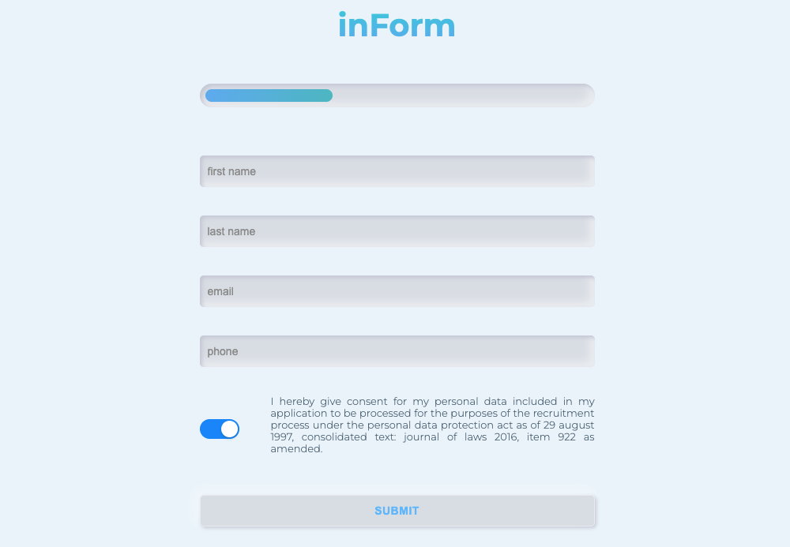

# React Neumorphism Form

## :technologist: Technologies and metodologies

Technologies and metodologies used in this project:

**React / Styled Components / Regex**

#### :clapper: Check live version: **[LIVE](https://rafalkazik.github.io/React-Neumorphism-Form/)**

## :gear: Installation

The project uses [node](https://nodejs.org/en/) and [npm](https://www.npmjs.com/). To run the app on your device you should install all dependencies. Then create a localhost port and run your web explorer.

Let's start with installing all dependencies. Move to the app main workspace and run:

    npm i

To create a localhost port you should type:

    npm start

Our repositories search engine is ready at port 3000.

    http://localhost:3000/

## :microscope: How it works?

This form could be used in recruitment process to contact with interested candidates. To submit this form, all data should be correct. The progress bar responds live to the correctness of the input.

### :exclamation: Form validation :exclamation:

To submit the form, your data should have the correct format:

- first name and last name should contain at least two characters;
- the e-mail address should be in the following format: **name@email.com**;
- the phone number should contain at least nine characters;
- acceptance of permission to the processing of personal data.

## :mailbox: Feel free to contact me

You can find me on **[LINKEDIN](https://www.linkedin.com/in/rafa%C5%82-kazik-924b8710a/)**
